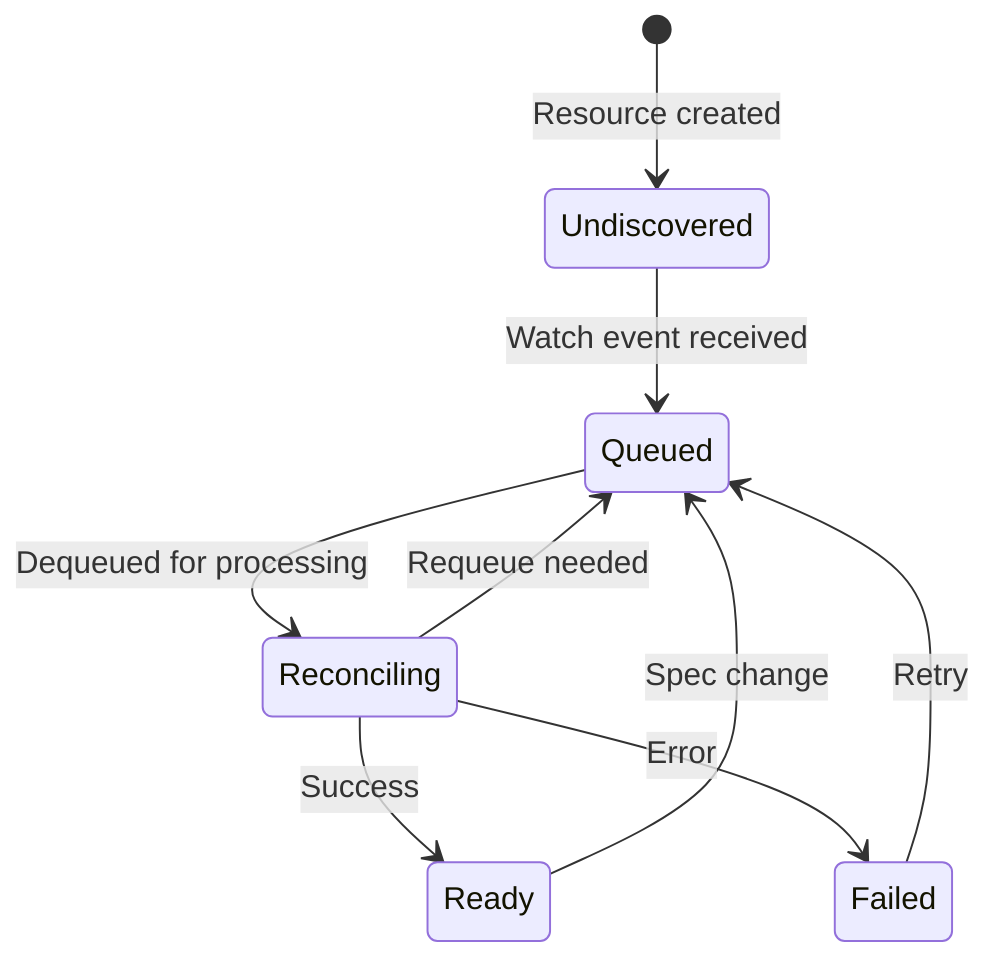

# Enhancement Proposal: Queue-Aware Status Reporting for Improved UX

## Overview

Enhance Kustomization controller to provide immediate, informative status updates for resources in the reconciliation queue, eliminating the misleading `observedGeneration: -1` problem during high load conditions.

## Goals

### Primary Objectives
1. **Eliminate UX Confusion**: Replace misleading "never seen" signals with accurate queue status
2. **Improve Observability**: Provide visibility into controller load and resource processing state  
3. **Enable Better Operations**: Give operators data for capacity planning and troubleshooting
4. **Maintain Performance**: Zero impact on reconciliation performance and minimal memory overhead

### Success Metrics
- ✅ Users can distinguish between "undiscovered" vs "queued" resources
- ✅ Queue depth and position visible in resource status
- ✅ Estimated processing times available for capacity planning
- ✅ Reduced false incident reports and unnecessary controller restarts

## Detailed Design

### Status State Transitions



### Enhanced Status Schema

#### Current Status (Problematic)
```yaml
status:
  observedGeneration: -1     # Misleading: suggests "never seen"
  conditions: []             # No information
```

#### Proposed Enhanced Status
```yaml
status:
  observedGeneration: 0      # Discovered but not processed
  queueMetadata:
    position: 15             # Position in queue (optional)
    estimatedProcessingTime: "2025-01-15T10:45:30Z"  # Estimated start (optional)
    queuedAt: "2025-01-15T10:40:00Z"        # When queued
  conditions:
  - type: Ready
    status: "False"
    reason: "Queued"
    message: "Resource queued for reconciliation (estimated processing in 5m30s)"
    lastTransitionTime: "2025-01-15T10:40:00Z"
  - type: Reconciling
    status: "False"  
    reason: "Pending"
    message: "Waiting for controller capacity"
    lastTransitionTime: "2025-01-15T10:40:00Z"
```

### Implementation Architecture

#### 1. Queue Status Manager

```go
// internal/queue/status_manager.go
package queue

import (
    "context"
    "sync"
    "time"
    "k8s.io/client-go/util/workqueue"
)

type QueueStatusManager struct {
    queue     workqueue.TypedRateLimitingInterface[reconcile.Request]
    mu        sync.RWMutex
    items     map[string]QueueItem
    client    client.Client
    
    // Configuration
    updateInterval    time.Duration
    enablePositions   bool
    enableEstimation  bool
}

type QueueItem struct {
    QueuedAt        time.Time
    Position        int  // Optional: current position in queue
    EstimatedStart  *time.Time  // Optional: estimated processing time
}

func NewQueueStatusManager(queue workqueue.TypedRateLimitingInterface[reconcile.Request], client client.Client) *QueueStatusManager {
    return &QueueStatusManager{
        queue:            queue,
        items:            make(map[string]QueueItem),
        client:          client,
        updateInterval:  30 * time.Second,  // Update positions every 30s
        enablePositions: true,              // Feature flag for position tracking
        enableEstimation: true,             // Feature flag for time estimation
    }
}

// TrackQueued records when a resource is queued for reconciliation
func (m *QueueStatusManager) TrackQueued(ctx context.Context, req reconcile.Request) error {
    m.mu.Lock()
    defer m.mu.Unlock()
    
    key := req.String()
    item := QueueItem{
        QueuedAt: time.Now(),
    }
    
    if m.enablePositions {
        item.Position = m.calculatePosition(req)
    }
    
    if m.enableEstimation {
        item.EstimatedStart = m.estimateProcessingTime(item.Position)
    }
    
    m.items[key] = item
    
    // Update resource status immediately
    return m.updateResourceStatus(ctx, req, item)
}

// TrackDequeued removes tracking when resource starts processing
func (m *QueueStatusManager) TrackDequeued(req reconcile.Request) {
    m.mu.Lock()
    defer m.mu.Unlock()
    delete(m.items, req.String())
}
```

#### 2. Enhanced Controller Integration

```go
// internal/controller/kustomization_controller.go

// Add to KustomizationReconciler struct
type KustomizationReconciler struct {
    // ... existing fields
    queueStatusManager *queue.QueueStatusManager
}

// Enhanced Reconcile method with immediate status updates
func (r *KustomizationReconciler) Reconcile(ctx context.Context, req ctrl.Request) (result ctrl.Result, retErr error) {
    // Existing resource fetching logic...
    obj := &kustomizev1.Kustomization{}
    if err := r.Get(ctx, req.NamespacedName, obj); err != nil {
        if apierrors.IsNotFound(err) {
            // Resource deleted - remove from tracking
            r.queueStatusManager.TrackDequeued(req)
            return ctrl.Result{}, nil
        }
        return ctrl.Result{}, err
    }

    // Mark as dequeued (processing started)
    r.queueStatusManager.TrackDequeued(req)

    // If this is the first time seeing this resource, initialize status appropriately
    if obj.Status.ObservedGeneration == -1 {
        // Resource was queued but never processed - this is now the first processing
        obj.Status.ObservedGeneration = 0
        conditions.MarkReconciling(obj, meta.ProgressingReason, "Starting first reconciliation")
        if err := r.patch(ctx, obj, patcher); err != nil {
            return ctrl.Result{}, fmt.Errorf("failed to update status: %w", err)
        }
    }

    // Continue with existing reconciliation logic...
    return r.reconcile(ctx, patcher, obj, revision, originRevision)
}
```

#### 3. Watch Handler Enhancement

```go
// internal/controller/kustomization_manager.go

// Enhanced SetupWithManager with queue tracking
func (r *KustomizationReconciler) SetupWithManager(ctx context.Context, mgr ctrl.Manager, opts KustomizationReconcilerOptions) error {
    // ... existing indexing setup
    
    // Initialize queue status manager
    r.queueStatusManager = queue.NewQueueStatusManager(opts.RateLimiter, mgr.GetClient())
    
    // Start background status updater
    go r.queueStatusManager.StartStatusUpdater(ctx)

    return ctrl.NewControllerManagedBy(mgr).
        For(&kustomizev1.Kustomization{}, builder.WithPredicates(
            predicate.Or(predicate.GenerationChangedPredicate{}, predicates.ReconcileRequestedPredicate{}),
        )).
        // Custom event handler that tracks queued items
        WithOptions(controller.Options{
            RateLimiter: &queueTrackingRateLimiter{
                RateLimiter:      opts.RateLimiter,
                queueStatusMgr:   r.queueStatusManager,
                ctx:             ctx,
            },
        }).
        // ... existing watches
        Complete(r)
}

// Wrapper around rate limiter to track queue operations
type queueTrackingRateLimiter struct {
    workqueue.TypedRateLimiter[reconcile.Request]
    queueStatusMgr *queue.QueueStatusManager
    ctx           context.Context
}

func (q *queueTrackingRateLimiter) AddRateLimited(item reconcile.Request) {
    // Track that this item was queued
    q.queueStatusMgr.TrackQueued(q.ctx, item)
    q.TypedRateLimiter.AddRateLimited(item)
}
```

#### 4. Status Update Logic

```go
// internal/queue/status_manager.go continued

func (m *QueueStatusManager) updateResourceStatus(ctx context.Context, req reconcile.Request, item QueueItem) error {
    obj := &kustomizev1.Kustomization{}
    if err := m.client.Get(ctx, req.NamespacedName, obj); err != nil {
        return err
    }
    
    // Only update if resource is still in "undiscovered" state
    if obj.Status.ObservedGeneration != -1 {
        return nil // Already processed or processing
    }
    
    // Set to "discovered but not processed" state
    obj.Status.ObservedGeneration = 0
    
    // Add queue metadata if enabled
    if m.enablePositions || m.enableEstimation {
        if obj.Status.QueueMetadata == nil {
            obj.Status.QueueMetadata = &kustomizev1.QueueMetadata{}
        }
        
        if m.enablePositions {
            obj.Status.QueueMetadata.Position = &item.Position
        }
        
        if m.enableEstimation && item.EstimatedStart != nil {
            obj.Status.QueueMetadata.EstimatedProcessingTime = &metav1.Time{Time: *item.EstimatedStart}
        }
        
        obj.Status.QueueMetadata.QueuedAt = &metav1.Time{Time: item.QueuedAt}
    }
    
    // Set appropriate conditions
    conditions.MarkFalse(obj, meta.ReadyCondition, "Queued", 
        "Resource queued for reconciliation%s", 
        m.formatEstimationMessage(item))
    conditions.MarkFalse(obj, meta.ReconcilingCondition, "Pending",
        "Waiting for controller capacity")
    
    // Update status
    return m.client.Status().Update(ctx, obj)
}

func (m *QueueStatusManager) formatEstimationMessage(item QueueItem) string {
    if !m.enableEstimation || item.EstimatedStart == nil {
        return ""
    }
    
    waitTime := time.Until(*item.EstimatedStart)
    if waitTime < 0 {
        return " (processing soon)"
    }
    
    return fmt.Sprintf(" (estimated processing in %v)", waitTime.Round(time.Second))
}
```

### API Schema Changes

#### Enhanced Kustomization Status

```go
// api/v1/kustomization_types.go

type KustomizationStatus struct {
    // ... existing fields
    
    // +optional
    QueueMetadata *QueueMetadata `json:"queueMetadata,omitempty"`
}

// QueueMetadata provides visibility into reconciliation queue state
type QueueMetadata struct {
    // QueuedAt indicates when the resource was queued for reconciliation
    // +optional
    QueuedAt *metav1.Time `json:"queuedAt,omitempty"`
    
    // Position indicates the current position in the reconciliation queue
    // This field is optional and may not be provided in all configurations
    // +optional
    Position *int `json:"position,omitempty"`
    
    // EstimatedProcessingTime provides an estimate of when reconciliation will begin
    // Based on current queue depth and historical processing times
    // +optional  
    EstimatedProcessingTime *metav1.Time `json:"estimatedProcessingTime,omitempty"`
}
```

### Feature Flags & Configuration

```go
// internal/features/queue_status.go
package features

const (
    // QueueStatusReporting enables immediate status updates for queued resources
    QueueStatusReporting Feature = "QueueStatusReporting"
    
    // QueuePositionTracking enables position tracking in reconciliation queue
    QueuePositionTracking Feature = "QueuePositionTracking"
    
    // QueueTimeEstimation enables estimated processing time calculation
    QueueTimeEstimation Feature = "QueueTimeEstimation"
)

// main.go additions
var (
    queueStatusEnabled     = flag.Bool("enable-queue-status", true, "Enable queue status reporting")
    queuePositionsEnabled  = flag.Bool("enable-queue-positions", false, "Enable queue position tracking (experimental)")
    queueEstimationEnabled = flag.Bool("enable-queue-estimation", false, "Enable processing time estimation (experimental)")
)
```

### Performance Considerations

#### Memory Overhead
- **Queue Tracking**: ~100 bytes per queued resource
- **Status Updates**: Batched every 30 seconds to minimize API calls
- **Cleanup**: Automatic cleanup when resources processed or deleted

#### Processing Impact
- **Zero Impact on Reconciliation**: Status updates happen asynchronously
- **Minimal Watch Overhead**: Uses existing watch infrastructure
- **Configurable Features**: Position tracking and estimation can be disabled

#### Scalability
- **Queue Size**: Handles queues with thousands of items efficiently
- **Memory Bounded**: Automatic cleanup prevents memory leaks
- **API Efficiency**: Batched status updates reduce API server load

## Migration & Rollout Strategy

### Phase 1: Basic Queue Status (Immediate)
- Implement basic "Queued" status instead of `observedGeneration: -1`
- No breaking changes - purely additive
- Can be enabled by default immediately

### Phase 2: Enhanced Metadata (Optional)
- Add position tracking and time estimation
- Behind feature flags initially
- Graduate to default after validation in production

### Phase 3: Ecosystem Adoption
- Extend pattern to other Flux controllers
- Update monitoring and alerting tooling
- Documentation and best practices

## Backward Compatibility

- **API Compatibility**: All changes are additive (optional fields)
- **Behavioral Compatibility**: Existing tooling continues to work
- **Migration Path**: No breaking changes - improved experience immediately

## Testing Strategy

### Unit Tests
- Queue status manager functionality
- Status update logic correctness
- Edge cases (resource deletion, controller restart)

### Integration Tests  
- End-to-end queue status flow
- Performance under load
- Feature flag behavior

### Performance Tests
- Memory usage with large queues
- API call efficiency with batched updates
- Queue processing latency impact

## Documentation Impact

### User Documentation
- Update troubleshooting guides to use new status fields
- Provide examples of healthy vs problematic queue states
- Migration guide for existing monitoring setups

### Operator Documentation
- Capacity planning using queue metrics
- Feature flag configuration guidance
- Performance tuning recommendations

## Future Enhancements

### Metrics Integration
- Expose queue depth as Prometheus metrics
- Processing time histograms for SLA monitoring
- Resource lifecycle duration tracking

### Advanced Queue Management
- Priority queues for critical resources
- Queue partitioning by namespace or priority
- Advanced scheduling algorithms

### Cross-Controller Coordination
- Shared queue visibility across Flux controllers
- Global cluster capacity assessment
- Coordinated backpressure mechanisms

---

This enhancement addresses a significant UX pain point while maintaining the controller's performance and reliability characteristics. The phased rollout approach allows for gradual adoption with minimal risk to existing deployments.